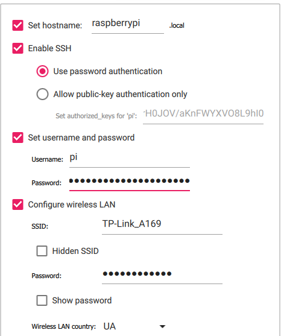

[WORK IN PROGRESS]
# rpi-rgb-led-panel

## Boot OS image into Raspberry

Use official imager https://www.raspberrypi.com/software/ that allows easily choose required distro and other settings via GUI.

### Choosing distro
Since desktop environment is not used, it is a good idea to install distro without it. Some good options are Paspberry Pi OS Lite (both 32- and 64- bits version is OKwith relyable hardware) and Ubuntu Server. They are both basically a port of Debian, so there is no big difference. However, Paspberry Pi OS is more preferable in terms of community support and because it is 'native' Raspberry's OS.

### Choosing flash storage
At least 64GB is recommended.

### Enabling SSH
If Rasperry Pi is going to be connected to the Internet via Wi-Fi, additional settings need to be configured. They include host's (Raspberry's) name, user's name and password, and, the most important, wireless LAN configuration - SSID (network name) and password.

After boot image is configured and created, it should be booted into Raspberry. If everything is correct, after a few minutes Rasperry will connect to the local wireless network. After that, you can access it with:
```
ssh [user_name]@[raspberry_local_ip]
```
When Raspberry is prepared and running, it is time to work with code.

### SSH configuration
Refer to [this StackOverflow thread](https://serverfault.com/questions/241588/how-to-automate-ssh-login-with-password).

## Compiling sources
sudo apt-get update


## Improve Performance
Switch off on-board sound (dtparam=audio=off in /boot/config.txt). External USB sound adapters work, and are much better quality anyway, so that is recommended if you happen to need sound. The on-board sound uses a timing circuit that the RGB-Matrix needs (it seems in some distributions, such as arch-linux, this is not enough and you need to explicitly blacklist the snd_bcm2835 module).

If you have a loaded system and one of the newer Pis with 4 cores, you can reserve one core just for the refresh of the display:

isolcpus=3

.. at the end of the line of /boot/cmdline.txt (needs to be in the same as the other arguments, no newline). This will use the last core only to refresh the display then, but it also means, that no other process can utilize it then. Still, I'd typically recommend it.